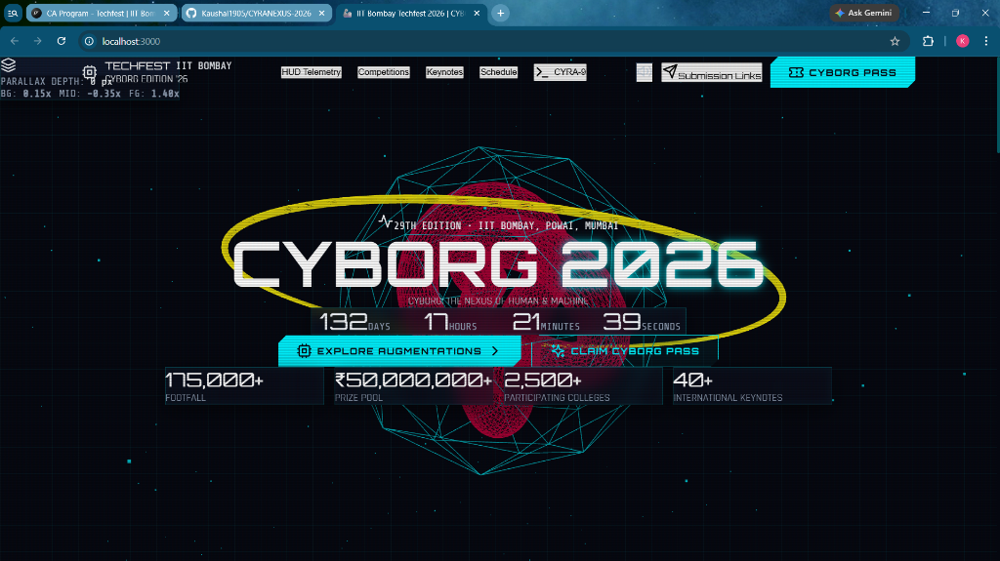
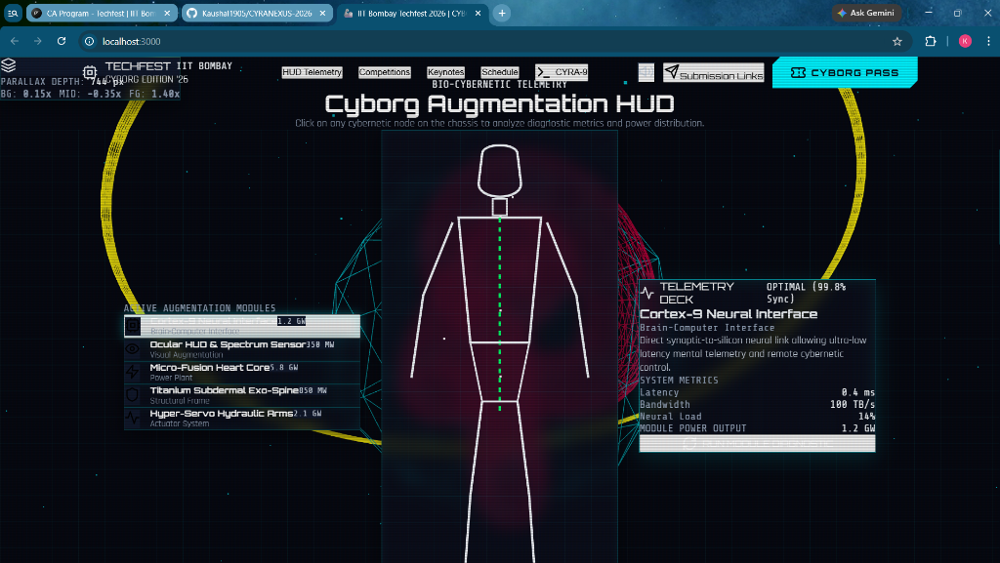

# 🦾 CYRANEXUS 2026 — IIT Bombay Techfest

> **Master 3D Interactive WebGL & Parallax Platform** for **IIT Bombay Techfest** (Asia's Largest Science & Technology Festival).

[](https://vitejs.dev/)
[](https://react.dev/)
[](https://threejs.org/)
[](https://developer.mozilla.org/en-US/docs/Web/API/Web_Audio_API)
[](https://techfest.org/)

---

## 📸 Real Application Screenshots

### 1. 🔮 3D WebGL Quantum Cyber Core & Hero Section


### 2. 🦾 Bio-Cybernetic Telemetry HUD Blueprint


---

## 🏆 Master Submission Feature Breakdown

CYRANEXUS 2026 is engineered as a unified, production-grade application fulfilling **Task 1, Task 2, and Task 3** in a single master WebGL experience.

```
CYRANEXUS 2026
├── Task 1: Responsive Cyborg Landing Page & Creative UI/UX
├── Task 2: 3D Interactive WebGL Objects & 3D Scroll Animations
└── Task 3: Multi-Layered Parallax Scrolling & 3D Mouse Tilt Cards
```

---

### 📌 Task 1: Responsive Cyborg Landing Page & Creative UI/UX
- **Cyberpunk Dark Aesthetic**: Custom neon cyan (`#00f3ff`) and electric magenta (`#ff0055`) glassmorphism, CRT scanline overlays, and Google Fonts (`Orbitron`, `Rajdhani`, `Share Tech Mono`).
- **Bio-Cybernetic Telemetry HUD**: Interactive chassis outline with hotspot target nodes (*Cortex-9 Neural Interface*, *Ocular HUD*, *Micro-Fusion Core*, *Exo-Spine*, *Hydraulic Arms*) displaying live metrics and a system diagnostic scanner.
- **Flagship Competition Matrix**: Search & sector filtering for flagship challenges (*RoboWars*, *Neural Mesh AI Hackathon*, *Bionic Prosthetics*, *Quantum CTF*) with prize pool counters (₹5,00,00,000+ total).
- **Web Audio API Audio Synth**: Zero-dependency real-time audio synthesizer producing sci-fi UI clicks, sweeps, and success chimes with navigation mute/unmute control.
- **CYRA-9 Holographic AI Terminal**: Sci-fi chatbot console answering festival commands (`/events`, `/schedule`, `/prizes`, `/venue`).
- **Custom Cyborg Pass Generator**: Real-time ticket creator generating personalized digital badges with HTML5 Canvas QR codes, unique hash codes, and print/download feature.

---

### 📌 Task 2: 3D Interactive WebGL & 3D Scroll Animations
- **Interactive 3D Three.js WebGL Core**:
  - Outer 3D glowing wireframe Icosahedron shell (`#00f3ff`).
  - Inner 3D rotating metallic Torus-Knot energy reactor (`#ff0055`).
  - Orbiting 3D gold telemetry ring.
  - 600 glowing 3D star particles distributed in spatial WebGL environment.
- **Interactive 3D Mouse Controls**: Drag anywhere on screen to rotate the 3D model 360° with cursor-follow spring physics.
- **3D Scroll-Driven Animations**: Camera perspective & 3D object geometries smoothly morph, scale, and transform between sections as you scroll (*Hero -> Telemetry HUD -> Competition Matrix -> Cyber Warp Terminal*).

---

### 📌 Task 3: Multi-Layered Parallax Scrolling & 3D Card Tilt
- **Multi-Speed Depth Parallax Layers**:
  - **Layer 0 (Far BG Grid)**: Moves slowly at **0.15x** scroll speed.
  - **Layer 1 (Midground Cyber Orbs & Rings)**: Drifts in counter-direction at **-0.35x** scroll speed with rotation.
  - **Layer 2 (Foreground UI Content)**: Moves at standard 1.0x scroll speed.
  - **Layer 3 (Foreground Particle Dust)**: Floats past at **1.4x** fast scroll velocity for extreme depth.
- **3D Mouse Parallax Tilt Cards**: HUD telemetry cards and competition cards dynamically tilt in 3D space (`perspective(1000px) rotateX(...) rotateY(...)`) following cursor movement.
- **Live Parallax Depth Gauge**: Floating bottom-left telemetry indicator showing live scroll depth (`px`) and active layer speed multipliers (`0.15x / -0.35x / 1.40x`).

---

## 🚀 Quick Start & Running Locally

### Prerequisites
- **Node.js**: v18.0.0 or higher
- **NPM**: v9.0.0 or higher

### Steps to Run

```bash
# 1. Clone the repository
git clone https://github.com/Kaushal1905/CYRANEXUS-2026.git

# 2. Navigate to project folder
cd CYRANEXUS-2026

# 3. Install dependencies
npm install

# 4. Start local development server
npm run dev

# 5. Open browser
# URL: http://localhost:3000
```

### Production Build

```bash
# Compile production WebGL bundle
npm run build

# Preview build locally
npm run preview
```

---

## 📤 Submission & Drive Link Info

- **GitHub Repository**: [github.com/Kaushal1905/CYRANEXUS-2026](https://github.com/Kaushal1905/CYRANEXUS-2026)
- **Google Drive Demo Folder**: [Google Drive Link](https://drive.google.com/drive/folders/1NpS6Ik8Zb5H2XrW_o-Wqng85H6Wec7Yg?usp=sharing) *(Viewer Access Enabled)*

---

*Built with passion for IIT Bombay Techfest 2026.*
